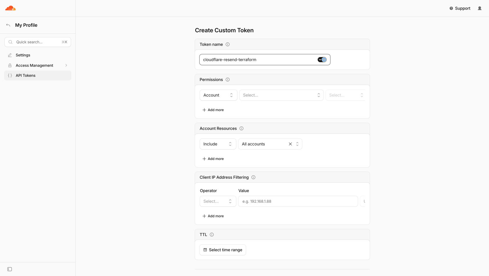
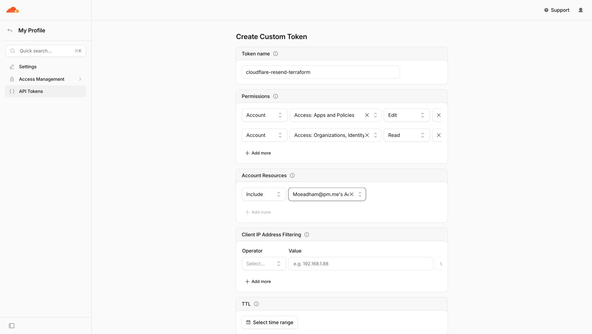
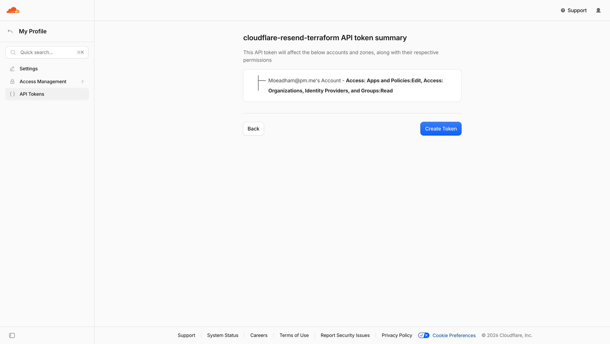

# Open Resend

> **Beta:** This project is under active development. We are looking for contributors to help make it feature-compatible with the official Resend client.

A lightweight, self-hosted mailing-list and campaign service built entirely on Cloudflare. Open Re-send provides a familiar browser interface for managing audiences and broadcasts, plus a focused Resend-compatible API for applications that already use the official Resend SDK.

## What it includes

- Contacts, named segments, and optional recipient-facing Topics
- Multiple sending domains and sender identities
- Rich-text campaign editing with preview text and test sends
- Draft, immediate, and scheduled broadcasts
- Searchable audience management and responsive desktop/mobile administration
- Global and Topic-specific unsubscribe preferences
- Branded unsubscribe pages, RFC 8058 headers, and physical-address footers
- Delivery status, retry controls, suppressions, and dead-letter handling
- Resend-style `re_` API keys and a compatible subset of the official SDK
- Cloudflare Access protection for the complete admin hostname

## Typical workflow

1. Enable a domain in Cloudflare Email Sending, then register it in **Domains**.
2. Add one or more sender identities. Every sender requires a physical postal address.
3. Create a segment and add contacts to it. A contact must be an active member of the selected segment to receive a broadcast.
4. Optionally create a Topic when recipients should be able to unsubscribe from one category without leaving every mailing.
5. Create a broadcast, choose a sender and segment, write the message, and save it for review.
6. Send a test, send immediately, or schedule delivery for later.

Topics are optional. A broadcast with a Topic unsubscribes recipients from that Topic; a broadcast without one uses global unsubscribe.

## Architecture

- One Worker dispatches by hostname: `ADMIN_HOSTNAME` serves the browser UI, `API_HOSTNAME` serves the Resend-compatible API, and deployment-configured unsubscribe hostnames serve public unsubscribe pages.
- The complete admin hostname is protected by a Cloudflare Zero Trust Access self-hosted application. The Worker also verifies the Access JWT.
- D1 stores application data, Queues fan out one message per recipient, and one Durable Object alarm is used per scheduled broadcast.
- Cloudflare Email Service is the only outbound transport.
- The admin interface is server-rendered Hono JSX with locally bundled Kiwa enhancements and Quill. No client-side SPA, CDN scripts, application passwords, or fallback login screen are used.

| Hostname | Purpose | Authentication |
| --- | --- | --- |
| `ADMIN_HOSTNAME` | Complete browser admin | Cloudflare Access plus Worker-side JWT validation |
| `API_HOSTNAME` | Resend-compatible API | `Authorization: Bearer re_...` |
| Per-domain unsubscribe hostname | Public preference and unsubscribe pages | Opaque membership or contact token |

## Local development

Requirements: Node.js 22+, a Cloudflare account, and Wrangler authentication. Terraform 1.10+ is additionally required for provisioning and production deploys.

```bash
npm install
cp .dev.vars.example .dev.vars
npm run build:assets
npx wrangler d1 migrations apply cloudflare-resend --local
npm run dev
```

Open [http://localhost:8787](http://localhost:8787). The local D1 database is independent of the deployed database, so development changes do not affect production data.

The local admin bypass works only when all three conditions hold:

- The request hostname is `localhost`, `127.0.0.1`, or `::1`.
- `ENVIRONMENT` is not `production`.
- `ALLOW_LOCAL_ADMIN=true` is set in `.dev.vars`.

The bypass cannot authenticate a non-local hostname or a production environment.

## Cloudflare provisioning

Terraform owns only the Zero Trust Access application and policy. Wrangler owns the Worker, custom domains, and bindings. This separation prevents the two tools from changing the same Cloudflare resources.

### Guided deployment

For a new installation, run:

```bash
npm run deploy
```

The guided deploy performs a complete preflight before it changes Cloudflare resources. It:

- verifies the active Wrangler account;
- asks for the admin, API, sending-domain, and per-domain unsubscribe hostnames;
- checks that every sending domain is already enabled in Cloudflare Email Sending without modifying domain onboarding;
- opens Cloudflare's API-token page and requests a hidden, in-memory Access token when one is not already in `CLOUDFLARE_API_TOKEN`;
- validates the token, Zero Trust organization, identity provider, application tests, and Terraform plan;
- inventories D1 and Queues and displays the exact create/reuse plan;
- waits for the user to type `DEPLOY` before making any Cloudflare changes;
- creates missing D1 and Queue resources, applies Access, migrates D1, deploys the Worker and custom domains, creates missing Email Sending event subscriptions, and verifies the public endpoints.

The Access token is never written to disk or printed. On macOS, install the supported Terraform-compatible runner once with `brew install opentofu`. On other platforms, install OpenTofu or Terraform and ensure `tofu` or `terraform` is on `PATH`.

The manual procedure below remains available for debugging and infrastructure review.

Before the first deployment, activate a Zero Trust plan for the Cloudflare account and configure Cloudflare as its account-member identity provider. New Zero Trust organizations include this identity provider by default. Terraform requires exactly one Cloudflare identity provider, restricts the application to it, and redirects authentication directly to it. The default policy admits members of the deploying Cloudflare account; set `allowed_account_id` to authorize members of a different account.

### Create the Terraform API token

In **Cloudflare Dashboard → My Profile → API Tokens**, select **Create Token**, then **Create Custom Token**.



Name the token `cloudflare-resend-terraform` and add these account permissions:

- **Access: Apps and Policies → Edit**
- **Access: Organizations, Identity Providers, and Groups → Read**

Under **Account Resources**, choose **Include → Specific account** and select only the account where this application will be deployed. An IP restriction or short TTL is optional, but a short TTL is sensible for a one-off manual deployment.



Select **Continue to summary** and verify that the summary contains only the two permissions and the intended account.



Select **Create Token**, copy the token from the one-time display, and export it for Terraform. The screenshots intentionally stop before the secret is shown. Never commit the token, paste it into an issue, or include it in a screenshot.

```bash
export CLOUDFLARE_API_TOKEN="paste-token-here"
```

### Provision and deploy

1. Confirm that the API token has these account permissions:

   - Access: Apps and Policies Edit
   - Access: Organizations, Identity Providers, and Groups Read

2. Configure and apply the Access infrastructure:

   ```bash
   cp infra/access/terraform.tfvars.example infra/access/terraform.tfvars
   # Fill in account_id and admin_hostname.
   terraform -chdir=infra/access init
   terraform -chdir=infra/access apply
   ```

   Terraform protects the complete admin hostname, attaches one Allow policy for Cloudflare account members, and outputs the application audience and Zero Trust team domain consumed by the Worker. Access denies identities that do not match an Allow policy by default.

3. Create D1 and retain the returned database ID:

   ```bash
   npx wrangler d1 create cloudflare-resend
   ```

4. Create the delivery, dead-letter, and Email Service event queues:

   ```bash
   npx wrangler queues create cloudflare-resend-deliveries
   npx wrangler queues create cloudflare-resend-deliveries-dlq
   npx wrangler queues create cloudflare-resend-email-events
   ```

5. Copy `.deployment.example.json` to `.deployment.json`, enter the API hostname and D1 database ID, and map each sending domain to its unsubscribe hostname:

   ```json
   {
     "apiHostname": "mail-api.example.com",
     "unsubscribeHostnames": {
       "example.com": "mail.example.com",
       "another-domain.com": "mail.another-domain.com"
     }
   }
   ```

   The keys must match the sending domains registered in the admin. Every value becomes a Wrangler-managed Worker Custom Domain, and campaigns select the hostname associated with their sender domain. Cloudflare creates the DNS records directly; do not create conflicting CNAME records manually.

   Render the deploy-only Wrangler configuration and apply D1 migrations:

   ```bash
   cp .deployment.example.json .deployment.json
   npm run config:deploy
   npx wrangler d1 migrations apply cloudflare-resend --remote --config wrangler.deploy.jsonc
   ```

   `.deployment.json`, Terraform state, `terraform.tfvars`, and `wrangler.deploy.jsonc` are ignored by Git. The checked-in `wrangler.jsonc` contains only local-development defaults.

6. Onboard every sending domain in **Cloudflare Dashboard → Compute & AI → Email Service → Email Sending**. Domain onboarding remains deliberately outside this application.

7. For every sending domain, create an Email Sending event subscription targeting `cloudflare-resend-email-events`. Subscribe to delivered, deferred, bounced, failed, rejected, and complained events.

8. Build and deploy manually. These commands regenerate `wrangler.deploy.jsonc` from Terraform outputs before invoking Wrangler:

   ```bash
   npm run check
   npm test
   npm run deploy:dry
   npm run deploy:worker
   ```

After signing into the admin hostname through Access, register each already-onboarded sending domain, add its sender identities, then create the first API key from the **API keys** page.

For shared or automated deployments, store Terraform state in a remote backend with locking rather than committing local state. A manually created Access application for the same hostname must be removed before applying this configuration; the project intentionally supports one Terraform-owned installation path rather than migration of dashboard-managed resources.

## Resend SDK compatibility

Compatibility is tested against the pinned official client, `resend@6.32.0`. Open Re-send is compatible with a focused campaign-management subset; it is not yet a drop-in replacement for every namespace exposed by the Resend client.

Configure the SDK with this service's base URL:

```ts
import { Resend } from "resend";

const resend = new Resend(process.env.MAIL_API_KEY, {
  baseUrl: "https://mail-api.example.com",
});

const segment = await resend.segments.create({ name: "Product updates" });
const topic = await resend.topics.create({
  name: "Product updates",
  description: "News about product improvements",
  defaultSubscription: "opt_in",
});

await resend.contacts.create({
  email: "reader@example.net",
  segments: [{ id: segment.data!.id }],
});

await resend.broadcasts.create({
  name: "October update",
  segmentId: segment.data!.id,
  topicId: topic.data!.id,
  from: "Example News <news@example.com>",
  subject: "Hello",
  html: "<p>Hello!</p>",
  send: true,
});
```

API keys use a `re_` prefix, are displayed once, and are stored only as SHA-256 hashes. `Idempotency-Key` is supported on broadcast mutations for 24 hours. Scheduling accepts ISO 8601 timestamps only.

### Implemented client surface

| Client namespace | Implemented methods |
| --- | --- |
| `resend.segments` | `create`, `list`, `get`, `update`, `remove` |
| `resend.topics` | `create`, `list`, `get`, `update`, `remove` |
| `resend.contacts` | `create`, `list`, `get`, `update`, `remove` by contact ID or email |
| `resend.contacts.segments` | `add`, `list`, `remove` |
| `resend.contacts.topics` | `list`, `update` |
| `resend.broadcasts` | `create`, `list`, `get`, `update`, `remove`, `send`, `cancel` |

The official client converts its camel-case options to the snake-case API fields used by the Worker. React broadcast content also works when the SDK can render it to HTML before making the request.

### Remaining compatibility work

The following gaps remain within the campaign and audience surface already implemented:

- Add `resend.broadcasts.recipients`, `resend.broadcasts.clickedLinks`, and `resend.broadcasts.duplicate`.
- Accept multiple `replyTo` addresses. Open Re-send currently accepts exactly one.
- Accept Resend's relative scheduling expressions such as `in 2 days`. Open Re-send currently requires an ISO 8601 timestamp.
- Implement cursor pagination for `contacts.segments.list` and `contacts.topics.list`; both currently return the complete result with `has_more: false`.
- Support deprecated `audienceId` request fields and legacy `/audiences/.../contacts` routes if legacy application compatibility is required. The client's `resend.audiences` alias itself points to the modern Segments client.
- Remove the Open Re-send-specific requirement that a broadcast's `from` address exactly match an active sender registered in the admin, or document an adapter strategy for applications that construct sender addresses dynamically.
- Expand official-client contract tests to cover every implemented get, update, remove, pagination, cancellation, scheduling, validation, and error path. The current suite proves the main end-to-end paths but is not yet an exhaustive SDK conformance suite.

The following Resend client namespaces are not implemented and remain outside the v1 scope:

- `resend.apiKeys` — keys are managed only through the protected admin site and are currently full-access.
- `resend.automations` and automation runs.
- `resend.batch` and transactional `resend.emails`, including attachments and inbound/receiving email operations.
- `resend.contactProperties` schema management and `resend.contacts.imports`. Arbitrary contact property values are stored, but property definitions and bulk CSV imports are absent.
- `resend.domains` and domain claims. Domains are onboarded in Cloudflare Email Sending and then registered manually in the admin.
- `resend.events`, `resend.logs`, and `resend.usage`.
- `resend.oauthGrants`.
- `resend.suppressions`, including batch suppression management. Open Re-send creates suppressions from hard bounces and complaints but does not expose the matching SDK routes.
- `resend.templates`.
- `resend.webhooks`, webhook events, replay, and delivery attempts. Cloudflare Email Service event subscriptions are configured outside the Resend-compatible API.

Also outside v1: public signup forms, broadcast recipient export, and open/click tracking.

## Segments, Topics, and unsubscribe behavior

- Segments are internal recipient groups used to choose who receives a broadcast. Removing a contact from a segment does not change that contact's email preferences.
- Topics are recipient-facing preference categories. A contact can opt in or out of a Topic across all segments.
- A broadcast tagged with a Topic gets a preference page with Topic toggles; RFC 8058 one-click unsubscribe opts the contact out of that Topic only.
- A broadcast without a Topic gets a global-unsubscribe page; submitting it marks the contact globally unsubscribed from all broadcasts.
- Every campaign gets text and HTML footers containing the selected sender's physical address and an unsubscribe link.
- Each campaign uses the unsubscribe hostname mapped to its sender's domain in `.deployment.json`. Sending and test-send preflight fail if that mapping is missing.
- Each email includes RFC 8058 `List-Unsubscribe` and `List-Unsubscribe-Post` headers.
- Browser `GET` displays confirmation or preference toggles without changing state. `POST` changes only the requested Topic preference unless the recipient explicitly chooses global unsubscribe.
- Authenticated admin and API operations can explicitly update global and Topic preferences.
- Queue messages contain only a delivery ID. State and cancellation are rechecked immediately before sending.
- Queue delivery is at least once. Atomic delivery claims remove normal duplicates, but a crash after Email Service accepts a message and before D1 records that result can still cause a rare duplicate.

## Verification

```bash
npm run check       # assets, generated bindings, strict TypeScript
npm test            # Worker-runtime tests and official Resend SDK contract tests
npm run deploy:dry  # Wrangler bundle and binding validation
npm audit --omit=dev
```

The Worker-runtime suite applies the real D1 migration and exercises API authentication, the pinned official Resend SDK, idempotent Broadcast creation, Access JWT validation, scanner-safe unsubscribe behavior, and generated MIME headers/body ordering. Staging delivery and event-subscription checks still require provisioned Cloudflare domains and queues.
